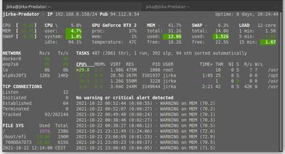

# Kaggle sandbox

This is a simple template project to Kaggle participation...

### Expected content:

- a core package with functionalities used across scripts and notebooks
- tutorial/experiment notebooks (in _notebook_ folder if needed)
- \[optional\] some functionality testing aka unittests or doctests

### What to write here:

- simple completion description + link
- shortly what task it is to solve
- list/link online sources
- link kernels/submissions

## Showcases

### Some derived projects

- [Multiple image classification](https://github.com/Borda/kaggle_image-classify)
  - [Herbarium 2022](https://www.kaggle.com/competitions/herbarium-2022-fgvc9)
  - [Plant Pathology 2021 - FGVC8](https://www.kaggle.com/c/plant-pathology-2021-fgvc8) as multi-label classification on apple tree leaf
  - [iMet Collection 2021 x AIC - FGVC8](https://www.kaggle.com/c/imet-2021-fgvc8) as multi-label classification on museum objects
  - [Cassava Leaf Disease Classification](https://www.kaggle.com/c/cassava-leaf-disease-classification/overview)
  - etc.
- [Multiple Image segmentation](https://github.com/Borda/kaggle_image-segm)
  - [Tract Image Segmentation](https://www.kaggle.com/competitions/uw-madison-gi-tract-image-segmentation) as semantic 3D segmentation from MRI scans
  - [Cell Instance Segmentation](https://www.kaggle.com/c/sartorius-cell-instance-segmentation) in microscopy images
  - etc.
- [COVID detection](https://borda.github.io/kaggle_COVID-detection) as object detection on CT (DICOM format) scans
- [Brain Tumor 3D](https://borda.github.io/kaggle_brain-tumor-3D) as image classification on MRI scans

### Author's writing

- [Best Practices to Rank on Kaggle Competition with PyTorch Lightning and Grid.ai Spot Instances](https://devblog.pytorchlightning.ai/best-practices-to-rank-on-kaggle-competition-with-pytorch-lightning-and-grid-ai-spot-instances-54aa5248aa8e)
- [Practical Lighting Tips to Rank on Kaggle Image Challenges](https://devblog.pytorchlightning.ai/practical-tips-to-rank-on-kaggle-image-challenges-with-lightning-242e2e533429)
- [Tackling the Kaggle COVID Detection Challenge with Lightning Flash and IceVision](https://medium.com/codex/tackle-covid-detection-with-lightning-flash-and-icevision-3f66f28c24ac)
- [Simple 3D MRI classification ranked bronze on Kaggle](https://towardsdatascience.com/simple-3d-mri-classification-ranked-bronze-on-kaggle-87edfdef018a)
- [Tabular Classification and Regression Made Easy with Lightning Flash](https://pub.towardsai.net/tabular-classification-and-regression-made-easy-with-lightning-flash-d33bea76a645)
- [Easy Kaggle Offline Submission With Chaining Kernel Notebooks](https://towardsdatascience.com/easy-kaggle-offline-submission-with-chaining-kernels-30bba5ea5c4d)
- [Kaggle hacking: Validate a simple hypothesis against a hidden dataset](https://towardsdatascience.com/kaggle-hacking-validate-a-simple-hypothesis-against-a-hidden-dataset-4cf02bb16510)
